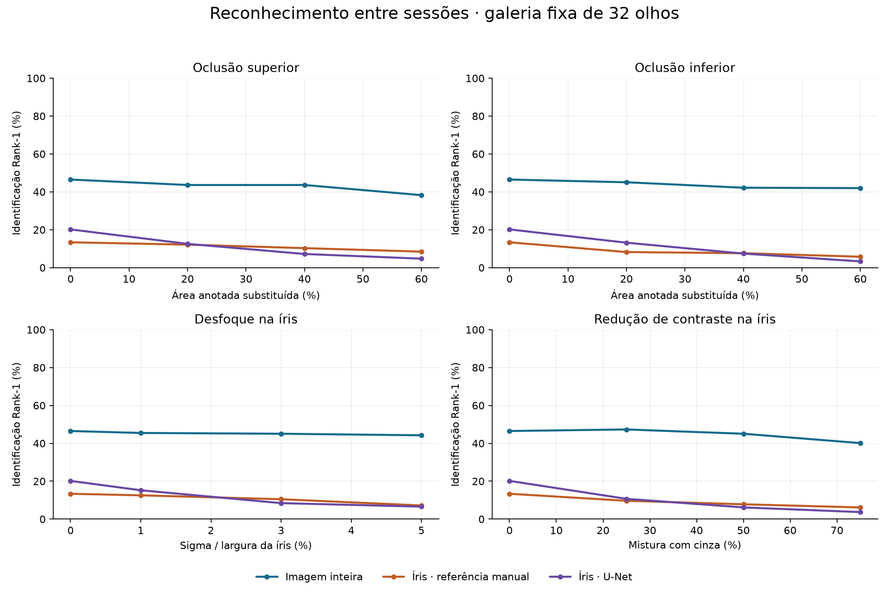
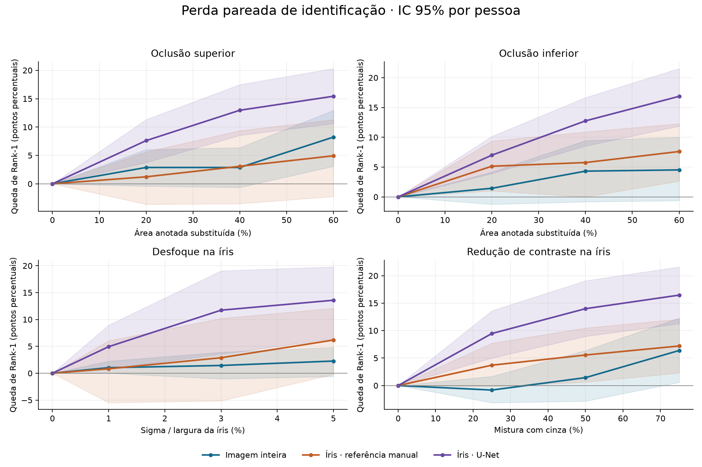
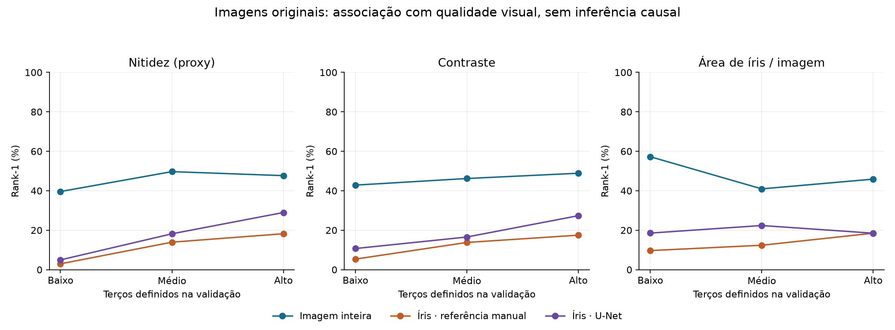

# Resultado experimental — perda de reconhecimento sob alterações visuais

**Data:** 01/10/2026. **Execução completa:** UBIPr, DINOv3 ViT-L/16 congelado, U-Net congelada. Sem rótulos clínicos.

## 1. O que foi executado

Validação: 16 pessoas, 32 olhos, 482 consultas. Teste: 16 pessoas distintas da validação, 32 olhos e 486 consultas; 474 imagens de galeria da sessão 1. Cada identidade é pessoa + lado. Foram avaliadas 13 condições em três entradas, totalizando 39 combinações e 18.954 decisões de identificação de teste. Não houve subamostragem de desenvolvimento.

A galeria é fixa e formada pela média normalizada dos embeddings da sessão 1. Apenas consultas da sessão 2 recebem perturbações. Os limiares de verificação são fixados no original da validação, com FAR empírica de no máximo 1%, tratando empates conservadoramente. A FAR de teste é medida, não presumida.

As alterações são restritas aos pixels anotados como íris: substituição por cinza 128 em 20/40/60% da área, começando por cima ou por baixo; desfoque gaussiano com sigma de 1/3/5% da largura da caixa da íris; mistura com cinza 128 em 25/50/75%. Não há alteração direta de pele ou sobrancelha. Níveis de desfoque e contraste não são percentuais de oclusão nem gravidade de doença.

O recorte manual usa a máscara original fixa (controle com informação privilegiada, não solução de produção). A U-Net segmenta novamente cada consulta alterada, incluindo o efeito da segmentação no reconhecimento. Os dois recortes usam a mesma regra de caixa e margem. Máscara prevista vazia conta como falha de extração, erro de identificação e rejeição. Seis consultas têm referência manual vazia: permanecem no denominador operacional de 486 e não recebem perturbação localizada; a coorte de 480 referências não vazias é avaliada separadamente em `sensibilidade_referencias_validas.csv`, sem excluir falhas causadas pelas perturbações.

A auditoria por SHA-256 não encontrou imagens exatamente duplicadas na população avaliada. Não é uma auditoria de quase-duplicatas ou validação clínica. Os ICs são percentis de 5.000 reamostragens por pessoa, mantendo seus olhos/consultas agrupados e a galeria fixa. São ICs pontuais, sem correção simultânea por múltiplas condições.

## 2. Linha de base corrigida para identidade ocular

| Entrada | Rank-1 | EER descritivo | TAR | FAR observada | Falhas de extração |
|---|---:|---:|---:|---:|---:|
| Imagem inteira | 46,50% | 15,64% | 25,51% | 0,87% | 0 |
| Íris · referência manual | 13,37% | 41,56% | 7,00% | 1,47% | 6 |
| Íris · U-Net | 20,16% | 38,22% | 9,67% | 1,14% | 3 |

Esses valores não devem ser comparados diretamente aos 74,28% anteriores: a galeria anterior agrupava pessoas e misturava lados; agora são 32 identidades oculares. A máscara manual e a U-Net são entradas de um extrator visual genérico, ainda sem adaptação específica para reconhecimento da textura da íris.

## 3. Perda medida nas condições mais intensas predefinidas

| Alteração | Entrada | Rank-1 alterado | Queda absoluta | IC 95% da queda | Queda relativa à base | TAR | FAR | Falhas |
|---|---|---:|---:|---|---:|---:|---:|---:|
| Oclusão superior 60% | Imagem inteira | 38,27% | 8,23 pp | [3,09; 12,96] pp | 17,70% | 2,67% | 0,01% | 0 |
| Oclusão superior 60% | Íris · referência manual | 8,44% | 4,94 pp | [-2,24; 11,32] pp | 36,92% | 0,00% | 0,00% | 6 |
| Oclusão superior 60% | Íris · U-Net | 4,73% | 15,43 pp | [10,62; 20,33] pp | 76,53% | 0,21% | 0,08% | 6 |
| Oclusão inferior 60% | Imagem inteira | 41,98% | 4,53 pp | [-0,62; 10,00] pp | 9,73% | 2,26% | 0,03% | 0 |
| Oclusão inferior 60% | Íris · referência manual | 5,76% | 7,61 pp | [2,64; 12,29] pp | 56,92% | 0,00% | 0,00% | 6 |
| Oclusão inferior 60% | Íris · U-Net | 3,29% | 16,87 pp | [11,88; 21,54] pp | 83,67% | 0,00% | 0,04% | 10 |
| Desfoque na íris 5% | Imagem inteira | 44,24% | 2,26 pp | [-0,60; 4,79] pp | 4,87% | 15,64% | 0,31% | 0 |
| Desfoque na íris 5% | Íris · referência manual | 7,20% | 6,17 pp | [-0,21; 12,08] pp | 46,15% | 0,00% | 0,00% | 6 |
| Desfoque na íris 5% | Íris · U-Net | 6,58% | 13,58 pp | [6,46; 19,79] pp | 67,35% | 0,00% | 0,05% | 3 |
| Redução de contraste na íris 75% | Imagem inteira | 40,12% | 6,38 pp | [0,58; 12,29] pp | 13,72% | 2,26% | 0,03% | 0 |
| Redução de contraste na íris 75% | Íris · referência manual | 6,17% | 7,20 pp | [2,29; 12,08] pp | 53,85% | 0,00% | 0,00% | 6 |
| Redução de contraste na íris 75% | Íris · U-Net | 3,70% | 16,46 pp | [11,25; 21,60] pp | 81,63% | 0,21% | 0,02% | 15 |

Queda negativa significa melhora observada. IC que cruza zero não sustenta direção clara da mudança nesta amostra. Não foram escolhidos os níveis pelo pior resultado: a tabela usa o maior nível previamente definido de cada família. A tabela completa com todos os níveis está em `resumo.csv`.





## 4. Alterações e qualidade nas imagens originais

Foram estratificadas as consultas originais por nitidez (variância do Laplaciano na parte interna da máscara, após padronização da caixa para 128 × 128), contraste (desvio-padrão de intensidade na íris) e proporção de pixels de íris na imagem. Os cortes são os terços da validação. Esses indicadores não são diagnósticos; proporção de íris também depende de distância, escala e olhar, e não mede oclusão anatômica.

| Entrada | Indicador | Rank-1 baixo | n baixo | Rank-1 alto | n alto | Alto − baixo | IC 95% |
|---|---|---:|---:|---:|---:|---:|---|
| Imagem inteira | sharpness | 39,60% | 101 | 47,66% | 214 | 8,06 pp | [-8,70; 25,89] |
| Imagem inteira | contrast | 42,86% | 112 | 48,88% | 223 | 6,02 pp | [-11,72; 24,49] |
| Imagem inteira | occupancy | 57,26% | 124 | 45,89% | 146 | -11,37 pp | [-28,21; 5,97] |
| Íris · referência manual | sharpness | 2,97% | 101 | 18,22% | 214 | 15,25 pp | [7,78; 22,97] |
| Íris · referência manual | contrast | 5,36% | 112 | 17,49% | 223 | 12,13 pp | [4,77; 19,76] |
| Íris · referência manual | occupancy | 9,68% | 124 | 18,49% | 146 | 8,82 pp | [2,82; 15,44] |
| Íris · U-Net | sharpness | 4,95% | 101 | 28,97% | 214 | 24,02 pp | [17,17; 31,16] |
| Íris · U-Net | contrast | 10,71% | 112 | 27,35% | 223 | 16,64 pp | [7,50; 25,89] |
| Íris · U-Net | occupancy | 18,55% | 124 | 18,49% | 146 | -0,06 pp | [-9,27; 10,82] |

Esses grupos contêm composições distintas de pessoas e imagens. Diferenças são associações observacionais, não perda causal por anomalia. O ensaio pareado da seção 3 é o controle que mantém as mesmas consultas e identidades entre condições.

### Controle adicional: comparação de qualidade dentro do mesmo olho

Incluímos apenas olhos com pelo menos duas consultas em cada extremo de qualidade, conservando os cortes da validação. Calculamos alto − baixo por olho e a média entre olhos, com bootstrap por pessoa. O controle remove a troca de identidade entre grupos, mas posição do olhar, iluminação e outros fatores continuam confundidos. Análise exploratória complementar, sem redefinir o teste principal.

| Entrada | Indicador | Olhos | Pessoas | Alto − baixo por olho | IC 95% |
|---|---|---:|---:|---:|---|
| Imagem inteira | sharpness | 23 | 12 | 4,81 pp | [-5,32; 14,54] |
| Imagem inteira | contrast | 21 | 13 | 8,19 pp | [-1,53; 18,61] |
| Imagem inteira | occupancy | 14 | 9 | -8,73 pp | [-27,31; 9,41] |
| Íris · referência manual | sharpness | 23 | 12 | 14,06 pp | [4,64; 23,51] |
| Íris · referência manual | contrast | 21 | 13 | 9,28 pp | [1,97; 17,95] |
| Íris · referência manual | occupancy | 14 | 9 | 14,37 pp | [5,95; 22,75] |
| Íris · U-Net | sharpness | 23 | 12 | 19,44 pp | [13,73; 26,03] |
| Íris · U-Net | contrast | 21 | 13 | 14,69 pp | [5,72; 24,97] |
| Íris · U-Net | occupancy | 14 | 9 | 13,52 pp | [6,81; 19,33] |




As imagens acima são escolhidas em posições de um e dois terços dentro de cada grupo de qualidade, sem consulta ao resultado de reconhecimento. Não representam rótulos de doença.

## 5. Amostra visual

Exemplo selecionado pela área mediana de íris anotada, sem consultar acerto/erro: `C347_S2_I12_L.jpg`.


## 6. Limites e comparação futura

O experimento quantifica a robustez deste sistema a alterações visuais definidas. Não estima efeito clínico de catarata, ceratite ou outra doença. Uma pequena perda na imagem inteira pode ocorrer porque o contexto periocular permanece disponível; não comprova que a textura da íris resistiu. Um baseline baixo nos recortes limita a interpretação de pequenas perdas adicionais (efeito de piso).

Há apenas 16 pessoas no teste e ICs condicionais à galeria fixa. Os resultados são descritivos deste ensaio exploratório: o teste do UBIPr já foi analisado em etapas anteriores. As severidades foram fixadas antes desta execução, mas não se deve apresentar o conjunto como um novo teste externo nunca observado.

Com Warsaw/CMPD: reutilizar definição de identidade, métricas, contagem de falhas e comparação pareada quando os dados permitirem; calibrar em validação própria do novo domínio, sem ajuste no teste. Comparar diferenças dentro de cada base, não subtrair acurácias brutas de bases com galerias, sensores e populações distintos. Pré/pós-cirurgia não isola automaticamente efeito de doença.

## 7. Reprodução e artefatos

A partir da pasta `pfc1-segmentacao-mmu`:

```powershell
& ../.venv/Scripts/python.exe -m unittest test_robustez_reconhecimento -v
& ../.venv/Scripts/python.exe -u avaliar_robustez_reconhecimento.py
& ../.venv/Scripts/python.exe relatar_robustez_reconhecimento.py
```

Os caches são retomáveis e vinculados ao hash do script. `protocolo.json` registra condições e hashes; `manifesto_auditado.csv` contém imagens e qualidade; `calibracao.json` contém os limiares; `scores_*.npz` preservam escores; `consultas.csv` preserva decisões individuais; `resumo.csv` contém métricas e ICs. Arquivos de imagem e embeddings devem permanecer sujeitos aos termos da base.

Verificação automatizada: cinco testes cobrem identidade ocular, empates de limiar, falhas de extração, preservação do contexto/área perturbada e bootstrap pareado.
